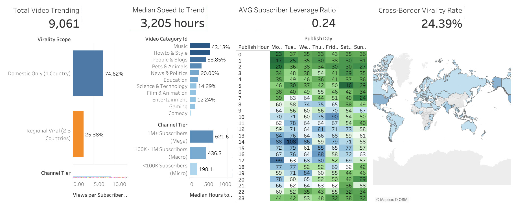

# 🎬 YouTube Trending Videos — Global Analytics & Executive Dashboard

> **An end-to-end data analytics project combining Python, SQL, and Tableau to analyze YouTube trending videos, audience engagement, channel performance, publishing patterns, and cross-country reach.**

[](https://www.python.org/)
[](https://www.mysql.com/)
[](https://public.tableau.com/)
[](https://colab.research.google.com/)

---

## 🚀 Quick Navigation

If you are reviewing this project as an interviewer, you can jump directly to the section you need:

* 📊 [Executive Dashboard](#-executive-dashboard)
* 💡 [Key Findings](#-key-findings)
* 🎯 [Business Questions](#-business-questions)
* 🧹 [Data Cleaning & Quality](#-data-cleaning--quality)
* 🐍 [Python Analysis](#-python-analysis)
* 🗄️ [SQL Analysis](#-sql-analysis)
* 📈 [Tableau Dashboard](#-tableau-dashboard)
* 🏗️ [Data Architecture](#️-data-architecture)
* 🧠 [Analytical Framework](#-analytical-framework)
* 📁 [Repository Structure](#-repository-structure)
* ⚠️ [Data & Methodology Notes](#️-data--methodology-notes)
* 🛠️ [Tools & Technologies](#️-tools--technologies)
* 👤 [Author](#-author)

---

## 📌 Project Overview

This project analyzes a global YouTube trending video dataset to understand **what characteristics are associated with trending performance**, including:

* video reach and view performance
* audience engagement through likes and comments
* category-level performance
* channel performance and subscriber leverage
* publishing day and hour patterns
* geographic reach across countries
* domestic vs cross-border trending behavior
* time from publication to observed trending
* video performance classifications
* relationships between views, likes, and comments

The project follows an end-to-end analytics workflow:

```text
Raw Dataset
     │
     ▼
Python Exploration & Validation
     │
     ▼
SQL Data Cleaning & Quality Control
     │
     ▼
SQL EDA & Advanced Analytics
     │
     ├──────────────► ML / Export-Ready Dataset
     │
     └──────────────► Analytical Star Schema
                              │
                              ▼
                         Tableau Dashboard
```

The goal is not only to produce visualizations, but to demonstrate a complete workflow from **raw data → validated data → analytical features → business insights → interactive dashboard**.

---

# 📊 Executive Dashboard

## Tableau Public



The current Tableau dashboard provides an executive-level view of:

* Total trending videos
* Median speed to trend
* Average subscriber leverage ratio
* Cross-border virality rate
* Virality scope
* Video category performance
* Channel subscriber tiers
* Publishing day × hour patterns
* Global geographic distribution

### Dashboard Snapshot

![YouTube Trending Dashboard]Youtube_trending.jpg

---

# 💡 Key Findings

The dashboard currently highlights four executive KPIs:

| KPI                                   | Current Dashboard Value |
| ------------------------------------- | ----------------------: |
| **Total Video Trending**              |               **9,061** |
| **Median Speed to Trend**             |         **3,205 hours** |
| **Average Subscriber Leverage Ratio** |                **0.24** |
| **Cross-Border Virality Rate**        |              **24.39%** |

### 🌍 Geographic Reach

The dashboard separates trending reach into different levels of geographic scope, including:

* **Domestic Only** — trending in 1 country
* **Regional Viral** — trending across 2–3 countries

The dashboard shows **74.62% Domestic Only** and **25.38% Regional Viral** within this displayed virality-scope analysis.

### 📚 Category Performance

The dashboard compares video categories based on their share/performance within the trending dataset.

The strongest displayed categories include:

* Music
* Howto & Style
* People & Blogs
* Pets & Animals
* News & Politics
* Education
* Science & Technology
* Film & Animation
* Entertainment
* Gaming
* Comedy

### 👥 Channel Tier Performance

Channels are segmented into:

* **1M+ Subscribers — Mega**
* **100K–1M Subscribers — Macro**
* **<100K Subscribers — Micro**

This allows subscriber scale to be compared with the video's observed view performance.

### ⏰ Publishing Patterns

The dashboard uses a **Publish Day × Publish Hour heatmap** to identify when videos were published and how the observed trending dataset is distributed across publishing times.

### 🗺️ Global Reach

A geographic map is used to visualize the international distribution of trending observations.

---

# 🎯 Business Questions

The analysis was designed around several practical questions.

### Reach & Virality

1. Which videos reach the largest number of countries?
2. How widespread is cross-country trending?
3. Which videos demonstrate strong geographic reach?

### Engagement

4. Which videos receive the highest number of likes?
5. Which videos have the strongest like-to-view ratios?
6. How are views, likes, and comments related?

### Channel Performance

7. Which channels generate the highest cumulative views?
8. How does channel size relate to video reach?
9. Which channels demonstrate strong subscriber leverage?

### Content Performance

10. Which video categories perform strongly?
11. How does performance differ across categories?
12. How are videos distributed between Regular, Viral, and Mega Viral classifications?

### Publishing Strategy

13. What publishing days and hours are most represented?
14. How quickly do videos appear in the observed trending dataset after publication?

---

# 🧹 Data Cleaning & Quality

The project uses both **Python and SQL** for data-quality control.

## Initial Dataset

The Python notebook loads:

```text
youtube_trending_videos_global_daily.parquet
```

The initial dataset contains:

* **18,993 rows**
* **28 columns**
* **9,061 unique videos**
* **111 trending countries**
* **14 video categories**
* **7,929 unique channels**

The dataset initially stores all 28 columns as string-like fields, requiring explicit type conversion before analysis.

---

## Data Cleaning Steps

### 1. Datetime Standardization

Python converts:

* `video_published_at`
* `video_trending__date`
* `channel_published_at`

into appropriate datetime types.

SQL performs equivalent temporal standardization using MySQL date parsing functions.

### 2. Numeric Conversion

The following fields are converted from strings into numeric types:

* `video_view_count`
* `video_like_count`
* `video_comment_count`
* `channel_view_count`
* `channel_subscriber_count`
* `channel_video_count`

### 3. Text Standardization

Important text fields are stripped and standardized before analysis.

### 4. Missing-Value Assessment

Missing values are explicitly measured rather than silently ignored.

The largest missing-value fields identified in the Python workflow include:

* `channel_country`
* `channel_custom_url`
* `video_comment_count`
* `video_like_count`
* `video_view_count`

The notebook also preserves missingness in analytical fields where appropriate.

### 5. Duplicate Validation

The analytical key is:

```text
video_id
+ video_trending__date
+ video_trending_country
```

Python found:

```text
Duplicate observations: 0
```

with the original dataset remaining at **18,993 rows** after the validation step.
SQL independently applies the same analytical grain during deduplication.

### 6. Negative-Value Validation

The notebook checks all major numerical metrics for impossible negative values.

Result:

```text
No negative values were found in the numerical columns.
```

### 7. YouTube-Specific Validation

The analysis checks:

```text
Likes <= Views
Comments <= Views
```

Results:

```text
Rows where likes exceed views: 0
Rows where comments exceed views: 0
```

```text
Rows where comments exceed views: 0
```

### 8. Temporal Consistency

The workflow also validates that:

```text
Video publication date <= Trending date
Channel publication date <= Video publication date
```

Both checks returned zero invalid records in the Python notebook.

---

# 🐍 Python Analysis

Python is used as the primary **exploration, preprocessing, validation, and statistical visualization layer**.

## Main Libraries

```python
pandas
numpy
matplotlib
seaborn
```

The notebook loads the Parquet dataset directly using:

```python
pd.read_parquet()
```

and creates a cleaned analytical copy for further analysis.

---

## Python Workflow

```text
Load Parquet Dataset
        │
        ▼
Initial Exploration
        │
        ▼
Missing-Value Analysis
        │
        ▼
Datetime & Numeric Conversion
        │
        ▼
Text Standardization
        │
        ▼
Duplicate Validation
        │
        ▼
Data Quality Validation
        │
        ▼
Exploratory & Statistical Analysis
```

---

## Python Analytical Questions

The notebook contains ten major analytical questions.

### Q1 — Highest-Liked Unique Video

The analysis aggregates country-level observations to the unique-video level before selecting the highest-liked video.

Current result:

**Avengers: Doomsday | Official Trailer | In Theaters December 18**

with **2,569,459 likes**.

### Q2 — Top 5 Most-Viewed Unique Videos in Indonesia

The analysis identifies the five highest-viewed unique videos observed in Indonesia.

The top result has approximately **3.40M views**.

### Q3 — Top Channels by Cumulative Views

The notebook calculates cumulative views across unique videos rather than summing repeated country-level observations.

The displayed top group includes:

* Marvel Entertainment
* Shilpi Raj Hits
* HYBE LABELS
* BABYMONSTER
* World Of Ramayana

### Q4 — Highest Like-to-View Ratios

The notebook evaluates like-to-view ratios using a minimum threshold of **1,000 views**.

The top displayed ratio is approximately **39.32%**.

### Q5 — Indonesian-Trending Videos Published in 2026

The analysis filters for:

```text
Country = Indonesia
Publication Year = 2026
Views >= 1,000,000
```

The top displayed result has approximately **3.40M views**.

### Q6 — Channel Performance Summary

Channels are evaluated using:

* number of unique videos
* average views
* maximum likes

The analysis aggregates metrics at the unique-video level before summarizing channels.

### Q7 — Video Performance Categories

Videos are classified using project-defined thresholds:

|      Views | Classification |
| ---------: | -------------- |
|     `< 1M` | Regular        |
| `1M–4.99M` | Viral          |
|     `≥ 5M` | Mega Viral     |

The notebook output contains:

| Category   | Observations |
| ---------- | -----------: |
| Regular    |       14,879 |
| Viral      |        2,905 |
| Mega Viral |        1,207 |

### Q8 — Views vs Likes

A log-scale scatter plot is used to explore the relationship between:

```text
Video Views
vs
Video Likes
```

This helps visualize engagement behavior across a highly skewed distribution.

### Q9 — Views vs Likes by Category

The analysis compares the views-versus-likes relationship across video categories.

### Q10 — Pairwise Relationships

The final Python analysis examines pairwise relationships among:

```text
Views
Likes
Comments
```

to identify broader engagement relationships.

---

# 🗄️ SQL Analysis

MySQL is used as the **data engineering, validation, analytical querying, and data-warehouse layer**.

## SQL Data Pipeline

```text
Original Dataset
       │
       ▼
youtube_trending_raw
       │
       ▼
youtube_trending_clean
       │
       ▼
Validation
       │
       ▼
Deduplication
       │
       ▼
youtube_trending
       │
       ├──────────────► EDA
       │
       ├──────────────► Advanced Analytics
       │
       ├──────────────► youtube_trending_ml
       │
       └──────────────► Star Schema
```

---

## SQL Cleaning & Validation

The SQL pipeline covers:

* raw-data preservation
* missing-value auditing
* literal `\N` conversion
* empty-value standardization
* country-code normalization
* numeric validation
* numeric type conversion
* negative-value validation
* datetime parsing
* temporal validation
* YouTube-specific logical validation
* analytical-grain validation
* duplicate detection
* final data-quality scorecard

---

## SQL Exploratory Analysis

The SQL analytical layer includes:

### Global Reach

Identifies videos appearing in the largest number of countries.

### Category Performance

Compares:

* trending entries
* unique videos
* average views
* average likes
* average comments

### Category Share

Measures category contribution based on trending entries rather than revenue.

### Median View Analysis

Calculates median view performance by category using window functions.

### Engagement Performance

Measures:

* average like ratio
* average comment ratio
* weighted like ratio
* weighted comment ratio

### Subscriber Leverage

Measures:

```text
Peak Video Views
──────────────────────
Subscriber Count
```

to evaluate video reach relative to channel subscriber scale.

### Title & Tag Analysis

Analyzes:

* average title length
* average tag count
* average views

### Time-to-First-Trending

Estimates the approximate time between publication and the first observed trending date.

### Global Virality Feature Engineering

Creates an ML-oriented target:

```text
is_global_viral = 1
when country_count > 10
```

The `country_count` variable is used to construct the target and therefore should not be used as a predictor in the same ML model to avoid target leakage.

### Engagement Anomaly Detection

Identifies videos with:

```text
Views > 100,000
AND
Like Ratio < 0.1%
```

### Consistently Trending Videos

Ranks videos by:

* trending days
* countries reached
* peak views

### Country-Level Performance

Compares countries based on:

* trending entries
* unique videos
* unique channels
* average views
* average likes

---

# 📈 Tableau Dashboard

Tableau is used as the **executive visualization and storytelling layer**.

## Dashboard Components

### KPI Cards

* Total Video Trending
* Median Speed to Trend
* Average Subscriber Leverage Ratio
* Cross-Border Virality Rate

### Virality Scope

Displays the distribution between:

* Domestic Only
* Regional Viral

### Category Analysis

Displays category-level performance and relative contribution.

### Channel Tier Analysis

Compares performance across:

* Micro
* Macro
* Mega channels

### Publishing Heatmap

A day × hour heatmap provides a compact view of publishing patterns.

### Global Map

A geographic visualization shows the international distribution of trending activity.

---

# 🏗️ Data Architecture

The SQL project also creates a lightweight analytical star schema.

```text
                 dim_channel
                      │
                      │
                      ▼
dim_date ─────► fact_trending_daily ◄───── dim_video
```

## Dimension Tables

### `dim_channel`

Contains channel-level attributes such as:

* channel ID
* channel title
* custom URL
* country
* publication date
* subscriber count
* video count

### `dim_video`

Contains video-level attributes such as:

* video ID
* channel ID
* title
* category
* duration
* definition
* licensed-content status
* publication timestamp

### `dim_date`

Provides calendar attributes including:

* year
* month
* month name
* quarter
* day
* day of week
* day name
* week number

## Fact Table

### `fact_trending_daily`

Grain:

```text
One video × one trending date × one country
```

Measures:

* view count
* like count
* comment count

A unique constraint is applied to:

```text
video_id
trending_date
trending_country
```

to preserve the intended analytical grain.

---

# 🧠 Analytical Framework

The project separates analysis into several layers.

| Layer                     | Purpose                                                 |
| ------------------------- | ------------------------------------------------------- |
| **Data Quality**          | Ensure reliable and logically consistent records        |
| **Descriptive Analytics** | Understand reach, engagement, categories, and channels  |
| **Diagnostic Analytics**  | Explore relationships between performance factors       |
| **Advanced Analytics**    | Time-to-trend, subscriber leverage, virality, anomalies |
| **ML Preparation**        | Create export-ready features and target variables       |
| **BI Visualization**      | Communicate findings through Tableau                    |

---

# 🔬 Key Metrics

## Like-to-View Ratio

```text
Likes
──────────── × 100
Views
```

Measures audience interaction relative to reach.

---

## Comment-to-View Ratio

```text
Comments
──────────── × 100
Views
```

Measures commenting activity relative to audience reach.

---

## Subscriber Leverage Ratio

```text
Peak Video Views
────────────────────
Channel Subscribers
```

A ratio above 1 indicates that the video reached more views than the channel's subscriber base.

---

## Time-to-Trend

The SQL analysis estimates:

```text
First Observed Trending Date
−
Video Publication Date
```

Because the dataset records a trending date rather than an exact moment when a video entered the trending system, this metric should be interpreted as an **approximate observed time-to-trend**, not an exact latency measurement.

---

# ⚠️ Data & Methodology Notes

### 1. Country-Level Grain

The intended analytical grain is:

```text
One video × one trending date × one country
```

Therefore, a single video may appear multiple times because it can trend in multiple countries.

### 2. Unique-Video Aggregation

For video-level analysis, country-level observations are not blindly summed.

Where appropriate, the Python analysis first aggregates to the unique-video level using maximum observed views or likes before performing higher-level calculations.

This avoids artificially inflating video performance through repeated country-level observations.

### 3. Virality Definitions

The project contains **different analytical definitions for different purposes**.

The Tableau dashboard displays geographic scope categories such as:

```text
Domestic Only
Regional Viral
```

while the SQL ML-oriented feature engineering uses:

```text
country_count > 10
```

as the threshold for `is_global_viral`.

These definitions should **not be interpreted as identical metrics**.

### 4. Time-to-Trend Limitation

The dataset contains trending dates rather than exact trending-entry timestamps.

Therefore, time-to-trend is an approximation based on the first observed trending date.

### 5. Snapshot Nature of the Dataset

The Python notebook shows that the loaded dataset contains a single observed trending date across the initial 18,993 rows.

Therefore, analyses involving repeated country-level observations should be interpreted as **cross-country distribution analysis within the available snapshot**, rather than a continuous historical time series.

### 6. Correlation vs Causation

The analysis identifies relationships and patterns.

It does **not** establish that publishing at a specific hour, having more subscribers, or belonging to a particular category directly causes a video to trend.

---

# 🛠️ Tools & Technologies

## Python

* Python 3.x
* Pandas
* NumPy
* Matplotlib
* Seaborn
* Google Colab
* Parquet

## SQL

* MySQL 8.0+
* MySQL Workbench
* CTEs
* Window Functions
* `ROW_NUMBER()`
* Aggregations
* Conditional logic
* Date/time functions
* Data-quality validation
* Star-schema modeling

## Tableau

* Tableau Public
* Interactive dashboards
* KPI cards
* Heatmaps
* Bar charts
* Geographic maps
* Analytical storytelling

---

# 📁 Repository Structure

Recommended repository structure:

```text
youtube-trending-analysis/
│
├── README.md
│
├── sql/
│   └── youtube_trending_analysis.sql
│
├── python/
│   └── Project5_Youtube_trending.ipynb
│
├── data/
│   └── youtube_trending_videos_global_daily.parquet
│
├── tableau/
│   └── youtube_dashboard_preview.jpg
│
└── images/
    └── youtube_dashboard_preview.png
```

### File Responsibilities

| File                                           | Purpose                                                                            |
| ---------------------------------------------- | ---------------------------------------------------------------------------------- |
| `README.md`                                    | Project documentation and analytical summary                                       |
| `youtube_trending_analysis.sql`                | SQL cleaning, validation, EDA, advanced analytics, ML preparation, and star schema |
| `Project5_Youtube_trending.ipynb`              | Python exploration, preprocessing, validation, and EDA                             |
| `youtube_trending_videos_global_daily.parquet` | Source dataset                                                                     |
| `youtube_dashboard_preview.png`                | Tableau dashboard preview                                                          |

---

# 🔗 Project Resources

### 📊 Tableau Public

PASTE_TABLEAU_PUBLIC_LINK_HERE

### 🐍 Google Colab

PASTE_GOOGLE_COLAB_LINK_HERE

### 🗄️ SQL Script

`./sql/youtube_trending_analysis.sql`

### 🐍 Python Notebook

`./python/Project5_Youtube_trending.ipynb`

---

# 🧭 End-to-End Workflow

The project can be summarized in five stages:

### Stage 1 — Understand

Explore:

* dataset structure
* dimensions
* data types
* missing values
* unique videos
* countries
* categories
* channels

### Stage 2 — Clean

Standardize:

* dates
* timestamps
* numeric fields
* text fields
* missing values
* country codes

### Stage 3 — Validate

Check:

* duplicate observations
* negative values
* likes > views
* comments > views
* publication-date inconsistencies
* analytical grain

### Stage 4 — Analyze

Investigate:

* reach
* engagement
* categories
* channels
* subscriber leverage
* time-to-trend
* virality
* anomalies
* publishing patterns

### Stage 5 — Communicate

Transform analytical results into an executive Tableau dashboard for faster decision-making and interpretation.

---

# 🎯 Project Outcomes

This project demonstrates the ability to:

* build a reproducible data-cleaning workflow
* work with semi-structured analytical datasets
* perform data-quality validation
* handle country-level repeated observations correctly
* aggregate data to video and channel levels
* calculate engagement metrics
* use SQL window functions and CTEs
* engineer analytical and ML-ready features
* design a basic analytical star schema
* perform exploratory analysis in Python
* translate analytical results into Tableau dashboards
* communicate technical analysis through business-oriented insights

---

# 👤 Author

**Mochammad Amir Hamzah**

Data Analytics Portfolio Project

**Core Skills Demonstrated:**

`SQL` · `Python` · `Data Cleaning` · `EDA` · `Data Quality` · `Feature Engineering` · `Tableau` · `Data Visualization` · `Analytical Storytelling`

---

## ⭐ Project Summary

> **From raw global YouTube trending data to an executive dashboard — this project demonstrates an end-to-end analytics workflow using Python for exploration and validation, SQL for structured data engineering and advanced analysis, and Tableau for interactive business intelligence.**

**Pipeline:**

```text
Python
Exploration & Validation
        ↓
SQL
Cleaning & Analytics
        ↓
ML / Analytical Data
        ↓
Tableau
Executive Dashboard
```

---
